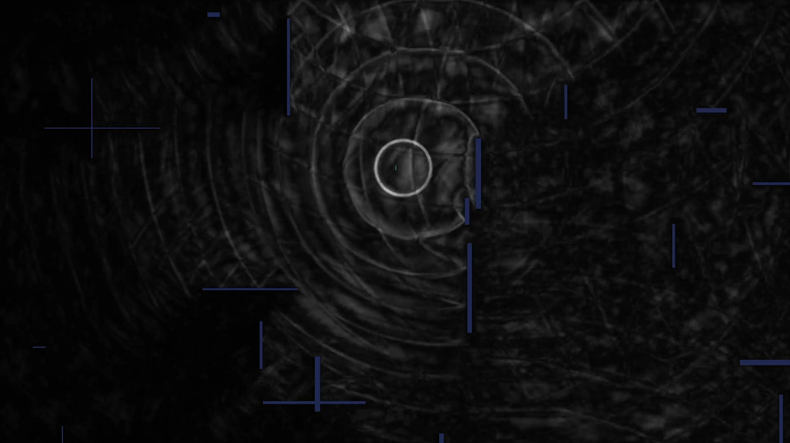

# Acoustic Space Rendering

This project uses [Ebiten](https://ebiten.org/) for graphics and an OpenCL-backed simulation. OpenCL is now required; follow the steps below to install the necessary Ubuntu packages and build the application. No build tags are needed.

## Demo



Watch the short walkthrough on YouTube: https://youtu.be/_3t1qPdWAT0

## Ubuntu dependency setup

### 1. Common build tools
Install basic build tooling used by Go modules and native dependencies:

```bash
sudo apt update
sudo apt install -y build-essential pkg-config git
```

### 2. Ebiten native libraries
Ebiten relies on OpenGL and X11. Install the development headers so the Go compiler can link against them:

```bash
sudo apt install -y libgl1-mesa-dev xorg-dev
```

- `libgl1-mesa-dev`: OpenGL headers and libraries for rendering.
- `xorg-dev`: X11 development headers required for window creation.

### 3. OpenCL toolchain (required)
Install the OpenCL ICD loader, headers, and diagnostic tool:

```bash
sudo apt install -y ocl-icd-opencl-dev opencl-headers clinfo
```

- `ocl-icd-opencl-dev`: OpenCL ICD loader and development files.
- `opencl-headers`: C headers for compiling against OpenCL.
- `clinfo`: Utility to verify that the system detects OpenCL platforms.

> **Tip:** Vendor-specific GPU drivers (e.g., NVIDIA, AMD, Intel) may provide additional optimized OpenCL implementations. Install the appropriate driver package from your vendor to access hardware acceleration.

### 4. Verify OpenCL availability
Confirm that OpenCL platforms are visible:

```bash
clinfo | head
```

If `clinfo` lists at least one platform, you are ready to build:

```bash
go build ./...
```

### Troubleshooting OpenCL startup errors

If the runtime prints `OpenCL initialization failed: querying OpenCL platforms: cl: error -1001`, no ICD loader reported any
available platforms. Install the OpenCL packages from step 3 and your GPU vendor's driver, then rerun `clinfo` to confirm a
platform is detected before launching the application.

## Building the project

Once dependencies are installed, install Go (if not already available) and build the project:

```bash
go build ./...
```

Run the application:

```bash
go run .
```

### Runtime options

Customize simulation behavior with additional flags:

- `-wall-reflect=<value>` — sets how strongly the outer walls reflect waves. Use a value between 0 (fully absorbing) and 1 (perfect reflection); the default is `0.4`.
- `-prefer-fp16=<true|false>` — toggles 16-bit OpenCL wave buffers when the GPU advertises `cl_khr_fp16`/`cl_khr_half_float`. Leave enabled to reduce bandwidth on capable devices; set to `false` to force 32-bit floats.
- `-enable-audio=<true|false>` — toggles experimental audio output driven by the simulator’s center samples; enable it to hear the impulse stream.
- `-audio-loop=<path>` — when audio is enabled, specify a WAV file (RIFF/PCM) that is resampled to 44.1 kHz and used to drive the emitter’s pressure waveform; audio output still comes from the simulator’s center sample stream.
- `-disable-walking-pulses=<true|false>` — when `true`, walking no longer queues the default impulse pulses so you only see the WAV-driven source or the silent field.
- `-show-last-frame=<true|false>` — when `true`, render only the most recent simulation frame instead of blending values across previous steps so you can inspect the raw wavefront (default `false`).

By default the application already runs with `-debug`, `-enable-audio`, `-capture-step-samples`, and `-disable-walking-pulses` while looping `test.wav`. Pass flag overrides such as `-debug=false` or `-audio-loop=their.wav` to change that behavior.
